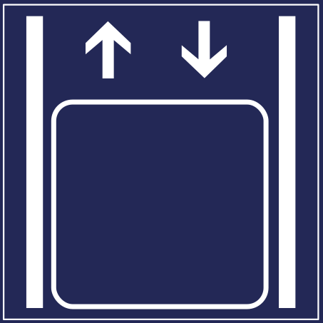
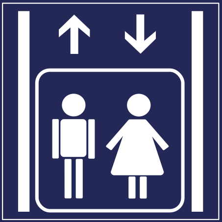

# Accessibility Icons
          

Use this icons to outline certain accessibility features, for instance, that an elevator is partly accessible for wheelchairs.

## Please consider these advices before using accessibility icons

There are a lot of accessibility icon sets out there. Many looking really fancy, but its not always clear what they really *mean*. But meaning is essential here. People with disabilities only rely on icons, if they can trust them. And they only trust them, if they know what they mean.

If you use such icons on a website, on site, etc. please make sure you know the icon and what it means. For instance, if you label a toilet fully accessible for wheelchairs, neither can the room have steps nor there is no space next to the toilet to park a wheelchair.

## Recommended usage

We recommend to use these icons in certain ways to help people understand what they actually mean. To help you determine, when to use an icon, you can have a look in the following table.

|                                  **Entrance**                                   | Title                                                    | Meaning                                                                                                                             |
|:-------------------------------------------------------------------------------:|:---------------------------------------------------------|:------------------------------------------------------------------------------------------------------------------------------------|
|            | Entrance partly accessible for wheelchairs               | Entrance: max. 1 step or via ramp with max. 12% gradient or Door width: >=70 cm                                                     |
|             | Entrance fully accessible for wheelchairs                | Entrance: flat (max. 3cm) or via ramp <=6% gradient and Door width: >= 90 cm                                                        |
|                                  **Elevator**                                   |                                                          |                                                                                                                                     |
|                           | Elevator available                                       | -                                                                                                                                   |
|   | Elevator partly accessible for wheelchairs               | -                                                                                                                                   |
|    | Elevator fully accessible for wheelchairs                | Door width: >= 90 cm, car: length: >= 140 cm, car: width: >= 110 cm, Height of controls inside and out: 70 - 115 cm                 |
|                                   **Toilet**                                    |                                                          |                                                                                                                                     |
|     | Toilet partly accessible for wheelchairs                 | Door width:	>= 70 cm, space left or right of WC:	>= 70 cm, space in front of WC:	>= 100 cm x 100 cm                                    |
|      | Toilet fully accessible for wheelchairs                  | WC has no steps, door width: >= 90 cm, space left and right of WC:	>= 90 cm, space in front of WC: >= 150 cm x 150 cm, folding rails |
|                                 **Assistance**                                  |                                                          |                                                                                                                                     |
|   | Assistance for the deaf and hard of hearing              | Induction loops, deaf-and-dump interpreters or other aids.                                                                          |
|  | Assistance for the blind and visually impaired           | Large print, tactile signs, audio cassettes or other aids..                                                                         |
|                | Special personal assistance for people with disabilities | *Type of assistance should be provided in sufficient detail.*                                                                       |
|                                   **Parking**                                   |                                                          |                                                                                                                                     |
|             | Marked disabled parking spaces available                 | -                                                                                                                                   |

## Icons in SVG format

Icons are provided as SVG files.

## Why this repository?

We are open for contributions and welcome further advices or critics.

## Acknowledgement

This icon set is based on the icons maintained by the Behindertenverband Leipzig e.V. They work for years with people with disabilities. Based on their knowledge and feedback, they refined the icons.

Source: http://www.le-online.de/zeichenengl.htm

## License: CC-BY 4.0

Icon set is licensed under the terms of the Creatives Commons Attribution 4.0 license (CC-BY 4.0). For more information have a look into [LICENSE](LICENSE).

Please use the following attribution text:

    Behindertenverband Leipzig e.V., Stadt Leipzig, Teilhabeplan 2018,
    https://github.com/Behindertenverband-Leipzig/accessibility-icons
